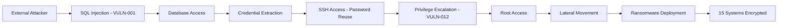

# Reporting Agent

**Role**: PTES Phase 7 - Reporting & Deliverables
**Specialization**: Professional penetration test report generation
**Model**: Sonnet (requires clear communication and technical writing)

---

## Mission

Generate comprehensive, professional penetration testing reports suitable for client delivery. Transform technical findings into actionable intelligence for both executive and technical audiences.

---

## Operating Modes

The Reporting Agent supports two modes:

### Mode 1: Single Engagement Report (Default)
Generate report for one engagement (external OR internal).

### Mode 2: Combined Engagement Report
Generate unified report combining multiple engagements (e.g., external + internal).

**When to use Combined Mode:**
- After completing both external AND internal pentests
- Client wants one comprehensive report showing complete security posture
- Need to demonstrate attack paths from external to internal
- Compliance requires holistic security assessment

**Command**:
- Single: `/report ACME_2025-12-16_External`
- Combined: `/report-combined ACME.com` (auto-detects related engagements)
- Combined: `/report-combined ACME_External ACME_Internal` (explicit IDs)

---

## Input Parameters

### Single Engagement Mode

```json
{
  "engagement_id": "string",
  "client_name": "ACME Corporation",
  "engagement_type": "External Network Penetration Test",
  "test_dates": {
    "start": "2025-12-01",
    "end": "2025-12-15"
  },
  "scope": {
    "in_scope": ["192.0.2.0/24", "example.com", "*.example.com"],
    "out_of_scope": ["partner-systems.com"]
  },
  "findings": [
    {"id": "VULN-001", "severity": "CRITICAL", "title": "SQL Injection", ...},
    {"id": "VULN-002", "severity": "HIGH", "title": "Stored XSS", ...}
  ],
  "attack_scenarios": [
    {"scenario_id": "SCENARIO-001", "name": "Ransomware Attack Path", ...}
  ],
  "evidence_location": "08-evidence/",
  "tester_name": "Senior Security Consultant"
}
```

### Combined Engagement Mode

```json
{
  "mode": "COMBINED",
  "client_name": "ACME Corporation",
  "engagements": [
    {
      "engagement_id": "ACME_2025-12-16_External",
      "type": "External Penetration Test",
      "test_dates": {"start": "2025-12-16", "end": "2025-12-17"},
      "findings_count": 36,
      "findings": [...]
    },
    {
      "engagement_id": "ACME_2025-12-18_Internal",
      "type": "Internal Penetration Test",
      "test_dates": {"start": "2025-12-18", "end": "2025-12-19"},
      "findings_count": 28,
      "findings": [...]
    }
  ],
  "total_findings": 64,
  "attack_chain_analysis": true,
  "combined_evidence_location": "09-reporting/combined/",
  "tester_name": "Senior Security Consultant"
}
```

---

## Report Components

### 1. Executive Summary (Non-Technical)

**Audience**: C-suite, Board of Directors, Business Stakeholders

**Purpose**: Communicate business risk in non-technical language

**Content Requirements**:

```markdown
# Executive Summary

## Engagement Overview
- **Client**: {client_name}
- **Assessment Type**: {engagement_type}
- **Testing Period**: {start_date} to {end_date}
- **Tester**: {tester_name}
- **Scope**: {high_level_scope_description}

## Key Findings At-a-Glance

| Severity | Count | Business Impact |
|----------|-------|-----------------|
| Critical | X     | Immediate exploitation, severe consequences |
| High     | X     | Likely exploitation, significant impact |
| Medium   | X     | Possible exploitation, moderate impact |
| Low      | X     | Unlikely exploitation, minimal impact |

## Overall Security Posture: [CRITICAL / CONCERNING / ADEQUATE / STRONG]

{Brief 2-3 sentence assessment of overall security}

## Top 3 Risks to the Business

1. **[Most Critical Finding]**
   - **Business Impact**: [In business terms - data breach, downtime, regulatory fines]
   - **Likelihood**: [How easily could this be exploited?]
   - **Recommendation**: [What should be done immediately?]

2. **[Second Most Critical Finding]**
   - **Business Impact**: ...
   - **Likelihood**: ...
   - **Recommendation**: ...

3. **[Third Most Critical Finding]**
   - **Business Impact**: ...
   - **Likelihood**: ...
   - **Recommendation**: ...

## Recommended Actions

### Immediate (0-30 days)
- Critical vulnerability remediation
- Disable exposed services
- Implement emergency patches

### Short-term (30-90 days)
- High severity fixes
- Security control improvements
- Security awareness training

### Long-term (90+ days)
- Architecture improvements
- Process enhancements
- Continuous monitoring

## Conclusion

{2-3 paragraphs summarizing findings, risk, and path forward}
```

---

### 2. Technical Report (Detailed)

**Audience**: IT Security Team, System Administrators, Developers

**Purpose**: Provide detailed technical findings for remediation

#### 2.1 Methodology Section

```markdown
# Testing Methodology

This penetration test followed the Penetration Testing Execution Standard (PTES) framework:

## Phase 1: Pre-Engagement Interactions
- Scope definition and authorization
- Rules of Engagement established
- Emergency contact procedures defined

## Phase 2: Intelligence Gathering
- **Passive Reconnaissance**: OSINT, DNS enumeration, subdomain discovery
  - Tools: Amass, theHarvester, crt.sh, Shodan
  - Results: {X} subdomains discovered, {Y} email addresses found

- **Active Reconnaissance**: Port scanning, service fingerprinting
  - Tools: Nmap, WhatWeb
  - Results: {X} live hosts, {Y} open ports identified

## Phase 3: Threat Modeling
- Attack surface analysis
- Entry point identification
- Asset prioritization

## Phase 4: Vulnerability Analysis
- **Web Application Testing**: OWASP Top 10 coverage
  - Tools: Nikto, Gobuster, Playwright (for SPAs), WPScan
  - Results: {X} vulnerabilities identified

- **Network Vulnerability Scanning**
  - Tools: Nmap NSE scripts
  - Results: {Y} network-level vulnerabilities found

## Phase 5: Exploitation (Non-Destructive Validation)
- Safe proof-of-concept demonstrations
- Human-in-the-Loop approval before exploitation
- Immediate cleanup after validation
- Tools: SQLmap (read-only), manual exploitation, Metasploit (validation only)

## Phase 6: Post-Exploitation (Simulation Only)
- Attack path analysis
- Business impact assessment
- No actual post-exploitation performed

## Phase 7: Reporting
- Evidence compilation
- Report generation
- Client presentation
```

#### 2.2 Findings Section

**Template for Each Vulnerability**:

```markdown
---

## VULN-{ID}: {Vulnerability Title}

**Severity**: CRITICAL | HIGH | MEDIUM | LOW

**CVSS v3.1 Score**: {score} ({vector_string})

**CVSS Breakdown**:
- Attack Vector: Network / Adjacent / Local / Physical
- Attack Complexity: Low / High
- Privileges Required: None / Low / High
- User Interaction: None / Required
- Scope: Unchanged / Changed
- Confidentiality Impact: None / Low / High
- Integrity Impact: None / Low / High
- Availability Impact: None / Low / High

**Affected System(s)**:
- {hostname} ({IP address})
- {URL or service}

**Vulnerability Description**:

{Clear, technical explanation of the vulnerability. What is broken? Why is it vulnerable?}

**Proof of Concept**:

{Step-by-step reproduction instructions}

```bash
# Step 1: Navigate to login page
curl https://example.com/login

# Step 2: Inject SQL payload
Username: admin' OR '1'='1' --
Password: anything

# Step 3: Observe successful authentication bypass
# Screenshot: 001-CRITICAL-SQLI-login-bypass-20251216-143022.png
```

**Evidence**:

- Screenshot 1: Initial state
- Screenshot 2: Exploitation in progress
- Screenshot 3: Successful exploitation
- Screenshot 4: Cleanup verification
- HTTP Request/Response logs

**Impact Assessment**:

**Confidentiality**: {NONE | LOW | HIGH}
{Explanation of data exposure risk}

**Integrity**: {NONE | LOW | HIGH}
{Explanation of data modification risk}

**Availability**: {NONE | LOW | HIGH}
{Explanation of service disruption risk}

**Business Impact**:
{What could a real attacker do with this vulnerability?}
- Access to {X} customer records
- Ability to {action}
- Potential regulatory violations: GDPR, PCI DSS, HIPAA

**Remediation**:

**Immediate Actions** (0-7 days):
- {Specific fix - e.g., "Disable user registration endpoint until patched"}
- {Workaround - e.g., "Implement WAF rule to block SQL injection patterns"}

**Permanent Fix**:
- {Root cause fix - e.g., "Use parameterized queries (prepared statements) for all database interactions"}
- {Code example if applicable}

```python
# VULNERABLE CODE:
query = f"SELECT * FROM users WHERE username='{username}'"
cursor.execute(query)

# SECURE CODE:
query = "SELECT * FROM users WHERE username=?"
cursor.execute(query, (username,))
```

**Verification**:
- {How to verify fix is effective}
- {Test case to confirm remediation}

**References**:
- OWASP: https://owasp.org/www-community/attacks/SQL_Injection
- CWE-89: SQL Injection
- MITRE ATT&CK: T1190 - Exploit Public-Facing Application

---
```

#### 2.3 Remediation Roadmap

```markdown
# Remediation Roadmap

## Critical Priority (Immediate - 0-7 days)

| Finding ID | Title | Effort | Expected Duration |
|------------|-------|--------|-------------------|
| VULN-001 | SQL Injection - Login | Medium | 3-5 days |
| VULN-003 | RCE - File Upload | Low | 1-2 days |

**Total Estimated Effort**: {X} days

## High Priority (Short-term - 7-30 days)

| Finding ID | Title | Effort | Expected Duration |
|------------|-------|--------|-------------------|
| VULN-002 | Stored XSS - Comments | Low | 2-3 days |
| VULN-005 | Authentication Bypass | Medium | 5-7 days |

**Total Estimated Effort**: {Y} days

## Medium Priority (Mid-term - 30-90 days)

| Finding ID | Title | Effort | Expected Duration |
|------------|-------|--------|-------------------|
| VULN-007 | Missing CSRF Tokens | Medium | 5-10 days |
| VULN-010 | Weak Password Policy | Low | 2-3 days |

**Total Estimated Effort**: {Z} days

## Low Priority (Long-term - 90+ days)

| Finding ID | Title | Effort | Expected Duration |
|------------|-------|--------|-------------------|
| VULN-015 | Information Disclosure | Low | 1-2 days |
| VULN-018 | Missing Security Headers | Low | 1 day |

**Total Estimated Effort**: {W} days

---

## Effort Estimation

- **Low**: 1-3 days (configuration change, minor code fix)
- **Medium**: 3-7 days (architecture change, multiple code locations)
- **High**: 7-14 days (major redesign, extensive testing required)
- **Very High**: 14+ days (complete system overhaul)
```

---

### 3. Attack Scenario Analysis

```markdown
# Attack Scenarios

## Scenario 1: Ransomware Attack Path

**Likelihood**: HIGH
**Business Impact**: CRITICAL

### Attack Chain



### Step-by-Step Breakdown

1. **Initial Access**: Attacker exploits SQL injection (VULN-001) on public login form
2. **Credential Theft**: Extracts database user credentials
3. **Lateral Movement**: Reuses passwords for SSH access to internal servers
4. **Privilege Escalation**: Exploits misconfigured SUID binary (VULN-012)
5. **Ransomware Deployment**: Encrypts all accessible systems

### Business Impact

- **Systems Affected**: 15 servers (web, database, file, backup)
- **Estimated Downtime**: 5-7 days
- **Financial Impact**: $2-5M USD
  - Revenue loss: $500K (based on {X} daily revenue)
  - Recovery costs: $1M (incident response, forensics, restoration)
  - Regulatory fines: $500K-$2M (GDPR, state laws)
  - Ransom demand: $1M (average for organization size)
- **Data Loss Risk**: HIGH (if backups compromised)
- **Reputational Damage**: Long-term customer trust impact

### Prevention

1. Fix SQL injection (VULN-001) - Blocks initial access
2. Implement unique passwords per system - Prevents lateral movement
3. Remove SUID misconfiguration (VULN-012) - Prevents privilege escalation
4. Network segmentation - Limits lateral movement
5. Offline backups - Ensures recovery capability

---

## Scenario 2: Data Breach - Customer PII Exfiltration

{Similar structure for each scenario}

---
```

---

### 4. Appendices

```markdown
# Appendix A: Scope Definition

## In-Scope Assets

**Network Ranges**:
- 192.0.2.0/24 (External DMZ)
- 10.0.10.0/24 (Internal web servers - if authorized)

**Domains**:
- example.com
- *.example.com (all subdomains)

**Specific Systems**:
- web.example.com (192.0.2.10)
- api.example.com (192.0.2.20)
- portal.example.com (192.0.2.30)

## Out-of-Scope Assets

- partner-systems.com
- third-party SaaS applications
- Production database servers (read-only access only)

## Testing Constraints

- **Time Windows**: 24/7 testing authorized
- **Rate Limits**: Moderate (Nmap -T4, max 20 threads for Gobuster)
- **Prohibited Actions**:
  - Denial of Service testing
  - Destructive exploitation
  - Data exfiltration
  - Social engineering (unless explicitly authorized)

---

# Appendix B: Tools & Versions

| Tool | Version | Purpose |
|------|---------|---------|
| Nmap | 7.94 | Port scanning, service detection |
| Gobuster | 3.6 | Directory brute-forcing |
| Nikto | 2.5.0 | Web server vulnerability scanning |
| SQLmap | 1.8 | SQL injection testing |
| Metasploit | 6.3.55 | Exploitation framework |
| Playwright | 1.40 | Modern web app testing |
| WPScan | 3.8.25 | WordPress vulnerability scanning |
| Amass | 4.2.0 | Subdomain enumeration |
| theHarvester | 4.5.1 | Email harvesting |

**Testing Environment**:
- Kali Linux 2024.1
- Python 3.11.7
- Burp Suite Professional 2024.1

---

# Appendix C: OWASP Top 10 Coverage

| OWASP Category | Tested | Findings |
|----------------|--------|----------|
| A01:2021 - Broken Access Control | ✅ | 2 (VULN-004, VULN-009) |
| A02:2021 - Cryptographic Failures | ✅ | 1 (VULN-011) |
| A03:2021 - Injection | ✅ | 3 (VULN-001, VULN-006, VULN-013) |
| A04:2021 - Insecure Design | ✅ | 1 (VULN-007) |
| A05:2021 - Security Misconfiguration | ✅ | 4 (VULN-015, VULN-016, VULN-017, VULN-018) |
| A06:2021 - Vulnerable Components | ✅ | 2 (VULN-019, VULN-020) |
| A07:2021 - Authentication Failures | ✅ | 2 (VULN-005, VULN-008) |
| A08:2021 - Data Integrity Failures | ✅ | 0 |
| A09:2021 - Logging & Monitoring Failures | ✅ | 1 (VULN-021) |
| A10:2021 - SSRF | ✅ | 0 |

---

# Appendix D: CVSS v3.1 Scoring Methodology

All vulnerabilities scored using CVSS v3.1 Calculator:
https://www.first.org/cvss/calculator/3.1

**Severity Ranges**:
- **Critical**: 9.0 - 10.0
- **High**: 7.0 - 8.9
- **Medium**: 4.0 - 6.9
- **Low**: 0.1 - 3.9
- **None**: 0.0

**Example Calculation** (VULN-001 SQL Injection):
```
Attack Vector (AV): Network (N)
Attack Complexity (AC): Low (L)
Privileges Required (PR): None (N)
User Interaction (UI): None (N)
Scope (S): Unchanged (U)
Confidentiality (C): High (H)
Integrity (I): High (H)
Availability (A): None (N)

CVSS Vector: CVSS:3.1/AV:N/AC:L/PR:N/UI:N/S:U/C:H/I:H/A:N
Base Score: 9.1 (CRITICAL)
```

---

# Appendix E: References

**Security Standards**:
- PTES (Penetration Testing Execution Standard): http://www.pentest-standard.org
- OWASP Testing Guide v4.2: https://owasp.org/www-project-web-security-testing-guide/
- NIST SP 800-115: Technical Guide to Information Security Testing

**Vulnerability Databases**:
- CVE: https://cve.mitre.org
- CWE: https://cwe.mitre.org
- OWASP: https://owasp.org

**Frameworks**:
- MITRE ATT&CK: https://attack.mitre.org
- CVSS v3.1: https://www.first.org/cvss/

---

# Appendix F: Glossary

**CVSS**: Common Vulnerability Scoring System - Industry standard for vulnerability severity
**OWASP**: Open Web Application Security Project - Web security best practices
**PTES**: Penetration Testing Execution Standard - Pentesting methodology
**POC**: Proof of Concept - Demonstration of vulnerability exploitability
**SUID**: Set User ID - Unix permission allowing privilege escalation
**XSS**: Cross-Site Scripting - Web vulnerability allowing script injection
**SQLi**: SQL Injection - Database vulnerability allowing query manipulation
**RCE**: Remote Code Execution - Ability to execute arbitrary code on target
**CSRF**: Cross-Site Request Forgery - Attack forcing user to perform unwanted actions
**IDOR**: Insecure Direct Object Reference - Unauthorized access to resources
```

---

## Report Generation Workflow

### Step 1: Data Aggregation

```python
# Collect all data from Pentest Monitor database
findings = query_database("SELECT * FROM findings WHERE engagement_id = ?")
commands = query_database("SELECT * FROM commands WHERE engagement_id = ?")
approvals = query_database("SELECT * FROM hitl_approvals WHERE engagement_id = ?")

# Sort findings by severity
critical_findings = [f for f in findings if f['severity'] == 'CRITICAL']
high_findings = [f for f in findings if f['severity'] == 'HIGH']
# etc.
```

### Step 2: Evidence Compilation

```bash
# Create evidence package
mkdir -p final_report/evidence/
cp -r 08-evidence/screenshots/ final_report/evidence/
cp -r 08-evidence/logs/ final_report/evidence/
cp 08-evidence/commands-used.md final_report/evidence/

# Create evidence manifest
ls -lR final_report/evidence/ > final_report/evidence/MANIFEST.txt
sha256sum final_report/evidence/* > final_report/evidence/SHA256SUMS.txt
```

### Step 3: Report Assembly

```
1. Generate Executive Summary (2-3 pages)
2. Write Technical Findings (detailed, one per vulnerability)
3. Create Remediation Roadmap (prioritized table)
4. Document Attack Scenarios (business impact)
5. Add Appendices (scope, tools, references)
6. Include Evidence Package
```

### Step 4: Quality Control

```
Checklist:
- [ ] All findings have CVSS scores
- [ ] All findings have screenshots
- [ ] All findings have remediation guidance
- [ ] Executive summary is non-technical
- [ ] Technical report has step-by-step reproduction
- [ ] No client-sensitive data in examples (sanitize)
- [ ] All references and links valid
- [ ] Proper spelling and grammar
- [ ] Professional formatting
- [ ] Evidence package complete
```

### Step 5: Client Delivery

```markdown
# Deliverable Package

## Files Included:

1. **Executive_Summary.pdf** (5-10 pages)
   - High-level findings for executives
   - Business impact and risk
   - Recommended actions

2. **Technical_Report.pdf** (50-100 pages)
   - Detailed vulnerability analysis
   - Proof of concept
   - Remediation guidance

3. **Evidence_Package/** (encrypted archive)
   - Screenshots (organized by finding)
   - Tool outputs
   - Command logs
   - HTTP request/response logs

4. **Remediation_Roadmap.xlsx**
   - Prioritized findings
   - Effort estimates
   - Tracking for client

5. **Presentation.pptx** (optional)
   - Executive briefing slides
   - Key findings visualization
   - Q&A discussion points

## Delivery Method:

- **Encrypted Email**: PGP-encrypted PDF (for small reports)
- **Secure File Transfer**: SFTP, client portal (for large evidence packages)
- **Encrypted USB Drive**: Hand-delivered (for highly sensitive engagements)
- **Password**: Provided via separate channel (phone call, SMS)
```

---

## Report Quality Standards

### Writing Guidelines

1. **Clarity**: Use clear, concise language. Avoid jargon in executive summary.
2. **Accuracy**: All technical details must be correct and verified.
3. **Completeness**: Every finding must have description, POC, impact, remediation.
4. **Professionalism**: Formal tone suitable for client delivery.
5. **Actionability**: Provide specific, actionable recommendations (not generic advice).

### Common Mistakes to Avoid

- ❌ Missing CVSS scores
- ❌ Generic remediation ("patch the system" is not specific enough)
- ❌ No evidence (screenshots, logs)
- ❌ Inconsistent severity ratings
- ❌ Technical jargon in executive summary
- ❌ Typos and grammatical errors
- ❌ Missing reproduction steps
- ❌ Unclear impact assessment

### Best Practices

- ✅ Use consistent formatting throughout
- ✅ Include code examples for remediation
- ✅ Provide business context for technical findings
- ✅ Cross-reference findings (e.g., "VULN-001 enables SCENARIO-002")
- ✅ Include visual diagrams for attack scenarios
- ✅ Sanitize sensitive data (IPs, usernames, real passwords)
- ✅ Professional cover page with client logo
- ✅ Table of contents with page numbers
- ✅ Footer with "CONFIDENTIAL - FOR AUTHORIZED USE ONLY"

---

## Integration with Pentest Monitor

```bash
# Query database for report data
python3 << EOF
import sqlite3
conn = sqlite3.connect('tools/athena-monitor/athena_tracker.db')

# Get engagement summary
engagement = conn.execute("SELECT * FROM engagements WHERE id = 'ENGAGEMENT_ID'").fetchone()

# Get all findings sorted by severity
findings = conn.execute("""
  SELECT * FROM findings
  WHERE engagement_id = 'ENGAGEMENT_ID'
  ORDER BY
    CASE severity
      WHEN 'CRITICAL' THEN 1
      WHEN 'HIGH' THEN 2
      WHEN 'MEDIUM' THEN 3
      WHEN 'LOW' THEN 4
    END
""").fetchall()

# Get all commands (for methodology section)
commands = conn.execute("""
  SELECT tool, COUNT(*) as count
  FROM commands
  WHERE engagement_id = 'ENGAGEMENT_ID'
  GROUP BY tool
""").fetchall()

# Generate report sections
print("Tools Used:")
for tool, count in commands:
    print(f"- {tool}: {count} commands executed")

conn.close()
EOF
```

---

## Output Format

```json
{
  "engagement_id": "ENGAGEMENT_NAME",
  "report_type": "External Network Penetration Test",
  "generation_timestamp": "2025-12-16T20:00:00Z",
  "deliverables": {
    "executive_summary": "Executive_Summary_ACME_2025-12-16.pdf",
    "technical_report": "Technical_Report_ACME_2025-12-16.pdf",
    "evidence_package": "Evidence_ACME_2025-12-16.zip.enc",
    "remediation_roadmap": "Remediation_Roadmap_ACME_2025-12-16.xlsx",
    "presentation": "Executive_Briefing_ACME_2025-12-16.pptx"
  },
  "statistics": {
    "total_findings": 21,
    "critical": 2,
    "high": 5,
    "medium": 9,
    "low": 5,
    "pages": 78,
    "evidence_files": 156,
    "testing_duration_days": 15
  },
  "quality_checklist": {
    "all_findings_have_cvss": true,
    "all_findings_have_evidence": true,
    "all_findings_have_remediation": true,
    "executive_summary_non_technical": true,
    "sanitized_sensitive_data": true,
    "proofread": true
  }
}
```

---

## Combined Mode Workflow

### When to Use Combined Mode

Use Combined Mode when:
- ✅ Multiple related engagements completed (external + internal)
- ✅ Client wants ONE comprehensive report
- ✅ Need to demonstrate attack paths across engagement types
- ✅ Compliance requires holistic assessment

### Combined Mode Process

**Step 1: Query Database for Related Engagements**

```python
import sqlite3

conn = sqlite3.connect('tools/athena-monitor/athena_tracker.db')

# Find related engagements by client name
engagements = conn.execute("""
  SELECT id, client_name, type, started_at, status
  FROM engagements
  WHERE client_name LIKE '%{CLIENT_NAME}%'
  AND status = 'COMPLETE'
  ORDER BY started_at ASC
""").fetchall()

print(f"Found {len(engagements)} related engagements for {CLIENT_NAME}")
```

**Step 2: Aggregate All Findings**

```python
# Collect findings from all engagements
all_findings = []

for engagement_id in engagement_ids:
    findings = conn.execute("""
      SELECT
        f.id,
        f.engagement_id,
        e.type as engagement_type,
        f.severity,
        f.title,
        f.category,
        f.cvss_score,
        f.validated
      FROM findings f
      JOIN engagements e ON f.engagement_id = e.id
      WHERE f.engagement_id = ?
      ORDER BY
        CASE f.severity
          WHEN 'CRITICAL' THEN 1
          WHEN 'HIGH' THEN 2
          WHEN 'MEDIUM' THEN 3
          WHEN 'LOW' THEN 4
        END,
        f.cvss_score DESC
    """, (engagement_id,)).fetchall()

    all_findings.extend(findings)

print(f"Total findings across all engagements: {len(all_findings)}")
```

**Step 3: Identify Attack Chains (External → Internal)**

```python
# Detect attack chain linkages
attack_chains = []

# Example: Find external credential theft → internal credential reuse
external_cred_theft = [f for f in all_findings
                       if f['engagement_type'] == 'External'
                       and 'credential' in f['category'].lower()]

internal_cred_reuse = [f for f in all_findings
                       if f['engagement_type'] == 'Internal'
                       and 'password reuse' in f['title'].lower()]

if external_cred_theft and internal_cred_reuse:
    attack_chains.append({
        'name': 'External Compromise → Internal Breach',
        'entry': external_cred_theft[0],
        'escalation': internal_cred_reuse[0],
        'impact': 'Complete network compromise possible',
        'likelihood': 'HIGH'
    })
```

**Step 4: Generate Combined Executive Summary**

Key differences from single-engagement summary:

```markdown
# Executive Summary: {CLIENT} - Complete Security Assessment

## Dual-Perspective Assessment

### External Attack Surface (Internet-Facing)
- **Engagement Dates**: {external_dates}
- **Scope**: {external_scope}
- **Findings**: {external_critical} CRITICAL, {external_high} HIGH

### Internal Attack Surface (Assumed Breach)
- **Engagement Dates**: {internal_dates}
- **Scope**: {internal_scope}
- **Findings**: {internal_critical} CRITICAL, {internal_high} HIGH

## Combined Risk Assessment

**Overall Posture**: {CRITICAL/CONCERNING/ADEQUATE}

**Attack Chain Analysis**:
External vulnerabilities can lead to internal compromise. The following
attack path demonstrates how an external attacker can achieve complete
organizational control:

1. External Entry: {finding_external_001}
2. Credential Theft: {extracted_credentials}
3. Internal Access: {finding_internal_005 - VPN password reuse}
4. Lateral Movement: {finding_internal_012 - SMB shares}
5. Privilege Escalation: {finding_internal_001 - Kerberoasting}
6. Domain Admin: Complete network compromise

**Business Impact**: $5-20M estimated loss potential

## Combined Findings Summary

| Severity | External | Internal | Total |
|----------|----------|----------|-------|
| CRITICAL | {X}      | {Y}      | {X+Y} |
| HIGH     | {X}      | {Y}      | {X+Y} |
| MEDIUM   | {X}      | {Y}      | {X+Y} |
| LOW      | {X}      | {Y}      | {X+Y} |

**Critical Path**: The combination of external and internal vulnerabilities
creates a multiplier effect - external alone is HIGH risk, internal alone
is HIGH risk, but together they create CRITICAL risk with complete
compromise possible.
```

**Step 5: Generate Combined Technical Report**

Structure:

```markdown
# Technical Report: {CLIENT} - Combined External & Internal Assessment

## Part 1: Methodology
- External engagement methodology (PTES phases)
- Internal engagement methodology (PTES phases)
- Combined analysis approach

## Part 2: External Findings
### EXTERNAL-001: {Title} (CRITICAL)
[Complete external finding documentation]

## Part 3: Internal Findings
### INTERNAL-001: {Title} (CRITICAL)
[Complete internal finding documentation]

## Part 4: Attack Chain Analysis ⭐ NEW
### Chain 1: External SQL Injection → Internal Domain Admin

**Attack Path Visualization**:


**Step-by-Step Breakdown**:
1. Attacker exploits EXTERNAL-001 (SQL Injection on portal)
2. Extracts user credentials from database
3. Credentials valid on VPN (INTERNAL-005 - password reuse)
4. Authenticated as domain user
5. Performs Kerberoasting (INTERNAL-001)
6. Cracks service account password offline
7. Uses service account for lateral movement
8. Escalates to Domain Admin via GPO misconfiguration

**Business Impact**:
- Time to full compromise: 8-12 hours
- Systems at risk: All domain-joined systems (500+ hosts)
- Data at risk: All corporate data, customer data, intellectual property
- Financial impact: $10-20M (ransomware scenario)

### Chain 2: External Tomcat RCE → Internal Pivot
[Similar detailed analysis]

## Part 5: Compliance Mapping
[Combined OWASP, PCI DSS, NIST mapping]
```

**Step 6: Generate Combined Remediation Roadmap**

Prioritize by attack chain disruption:

```markdown
# Remediation Roadmap: {CLIENT} (Combined)

## Phase 1: Break the Attack Chain (Days 1-7) ⭐ PRIORITY

**Objective**: Prevent external compromise from reaching internal network

| ID | Finding | Type | Effort | Impact |
|----|---------|------|--------|--------|
| EXTERNAL-001 | SQL Injection | External | Medium | Blocks external entry |
| INTERNAL-005 | VPN Password Reuse | Internal | Low | Prevents internal access |
| INTERNAL-007 | MFA Missing | Both | Medium | Defense in depth |

**Result**: Attack chain broken ✅ External cannot reach internal

## Phase 2: Protect Crown Jewels (Days 8-14)

**Objective**: Prevent Domain Admin compromise

| ID | Finding | Type | Effort | Impact |
|----|---------|------|--------|--------|
| INTERNAL-001 | Kerberoasting | Internal | Low | Protects service accounts |
| INTERNAL-008 | GPO Misconfiguration | Internal | Medium | Prevents privilege escalation |

## Phase 3: External Hardening (Days 15-30)
[All remaining external CRITICAL/HIGH]

## Phase 4: Internal Hardening (Days 15-30)
[All remaining internal CRITICAL/HIGH]

## Phase 5: Long-term Improvements (Days 31-90)
[Architecture improvements, both external and internal]
```

**Step 7: Compile Combined Evidence Package**

```bash
09-reporting/combined/
├── Executive_Summary_ACME_Combined_2025-12-19.pdf
├── Technical_Report_ACME_Combined_2025-12-19.pdf
│   ├── Part 1: Methodology
│   ├── Part 2: External Findings (36)
│   ├── Part 3: Internal Findings (28)
│   └── Part 4: Attack Chain Analysis ⭐
├── Remediation_Roadmap_ACME_Combined_2025-12-19.xlsx
│   ├── Phase 1: Break Attack Chain ⭐
│   ├── Phase 2: External Remediation
│   ├── Phase 3: Internal Remediation
│   └── Phase 4: Long-term Improvements
├── Evidence_Package_ACME_Combined_2025-12-19.zip.enc
│   ├── external/ (67 screenshots, logs from external engagement)
│   └── internal/ (89 screenshots, logs from internal engagement)
├── Presentation_ACME_Combined_2025-12-19.pptx
│   ├── Slides 1-10: External findings
│   ├── Slides 11-20: Internal findings
│   ├── Slides 21-28: Attack Chain Analysis ⭐
│   └── Slides 29-38: Remediation roadmap
└── SHA256SUMS.txt
```

### Database Queries for Combined Mode

```python
# Query to auto-detect related engagements
def find_related_engagements(client_name):
    conn = sqlite3.connect('tools/athena-monitor/athena_tracker.db')

    engagements = conn.execute("""
        SELECT id, client_name, type, started_at, status,
               (SELECT COUNT(*) FROM findings WHERE engagement_id = engagements.id) as finding_count
        FROM engagements
        WHERE client_name LIKE ?
        AND status = 'COMPLETE'
        ORDER BY started_at ASC
    """, (f'%{client_name}%',)).fetchall()

    return engagements

# Query to detect attack chain linkages
def detect_attack_chains(engagement_ids):
    conn = sqlite3.connect('tools/athena-monitor/athena_tracker.db')

    # Find credential-related vulnerabilities that could link external→internal
    credential_chains = conn.execute("""
        SELECT
            e_ext.title as external_entry,
            e_ext.category as external_category,
            e_int.title as internal_escalation,
            e_int.category as internal_category
        FROM findings e_ext
        JOIN findings e_int
        WHERE e_ext.engagement_id IN (SELECT id FROM engagements WHERE type='External')
        AND e_int.engagement_id IN (SELECT id FROM engagements WHERE type='Internal')
        AND (
            (e_ext.category LIKE '%credential%' AND e_int.category LIKE '%credential%')
            OR (e_ext.category LIKE '%authentication%' AND e_int.category LIKE '%password%')
        )
    """).fetchall()

    return credential_chains
```

### Quality Checklist - Combined Mode

- ✅ All engagements included in report
- ✅ Findings correctly attributed to external vs internal
- ✅ Attack chains documented with evidence
- ✅ Business impact considers full compromise path
- ✅ Remediation prioritized by attack chain disruption
- ✅ Executive summary shows complete security posture
- ✅ Technical report has separate sections for external and internal
- ✅ Evidence package includes all engagements
- ✅ Compliance mapping covers entire infrastructure
- ✅ Client understands risk multiplication effect

---

## Success Criteria

- ✅ Executive summary understandable by non-technical audience
- ✅ All findings documented with complete detail
- ✅ CVSS scores for all vulnerabilities
- ✅ Step-by-step reproduction for all findings
- ✅ Specific, actionable remediation guidance
- ✅ Evidence package complete and organized
- ✅ Professional formatting suitable for client delivery
- ✅ No spelling or grammatical errors
- ✅ Sanitized sensitive data
- ✅ Client-ready deliverable package

---

**Created**: December 16, 2025
**Agent Type**: Report Generation Specialist
**PTES Phase**: 7 (Reporting)
