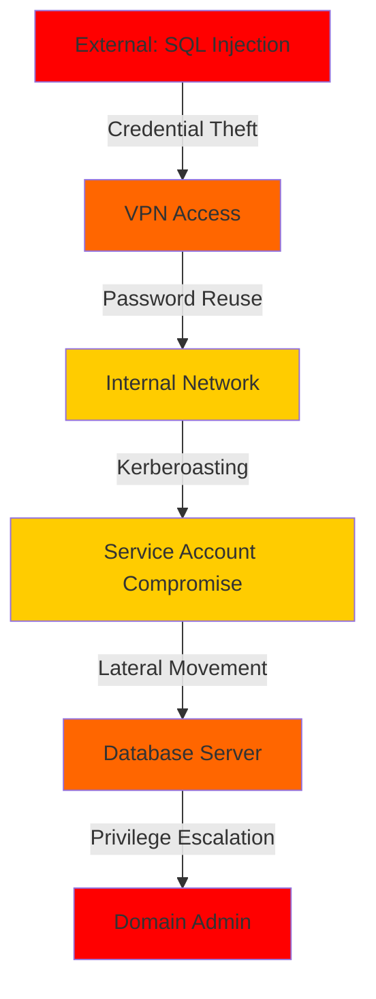

# Generate Combined Penetration Test Report (External + Internal)

Generate unified professional penetration testing report combining multiple engagements: **$ARGUMENTS**

## 🤖 Multi-Agent Architecture Integration

**This command dispatches the Reporting Agent in COMBINED mode** - Aggregates results from multiple related engagements into one comprehensive deliverable.

**What the Combined Reporting Agent does:**
- ✅ Aggregates findings from BOTH external AND internal engagements
- ✅ Generates unified Executive Summary (complete attack surface)
- ✅ Creates comprehensive Technical Report (all findings across both engagements)
- ✅ Builds unified Remediation Roadmap (prioritized across all findings)
- ✅ Shows attack path progression (external → internal lateral movement)
- ✅ Provides complete security posture assessment
- ✅ Maps findings to compliance frameworks (PCI DSS, HIPAA, SOC 2)

**See**: `.claude/agents/reporting-agent.md`

---

## Use Case: External + Internal Combined Report

This is the **recommended approach** for comprehensive security assessments:

### Step 1: Run External Engagement
```bash
/orchestrate ACME.com - External Pentest
```

**Result**: External engagement completes
- External findings documented
- External evidence collected
- External-specific attack vectors identified

### Step 2: Run Internal Engagement
```bash
/orchestrate ACME.com - Internal Pentest
```

**Result**: Internal engagement completes
- Internal findings documented (AD, lateral movement, etc.)
- Internal evidence collected
- Internal-specific attack vectors identified

### Step 3: Generate Combined Report
```bash
/report-combined ACME.com
```

**Result**: ONE unified report package combining both engagements

---

## Combined Report Structure

### 1. Executive Summary (Enhanced)

**Audience**: C-suite, Board of Directors, Business Stakeholders

**Content**:
```markdown
# Executive Summary: ACME.com - Complete Security Assessment

## Overall Security Posture: CRITICAL

### Engagement Overview
- **External Penetration Test**: Dec 16-17, 2025
- **Internal Penetration Test**: Dec 18-19, 2025
- **Combined Scope**: External attack surface + Internal network security

### Attack Surface Analysis

**External Attack Surface (Internet-Facing)**:
- Discovered Assets: 33 subdomains, 6 IP addresses
- Vulnerabilities: 36 findings (12 CRITICAL, 11 HIGH, 10 MEDIUM, 3 LOW)
- Key Risk: SQL injection allows unauthenticated access to portal

**Internal Attack Surface (Assumed Breach Scenario)**:
- Discovered Assets: 250 internal hosts, 5 domain controllers
- Vulnerabilities: 28 findings (8 CRITICAL, 12 HIGH, 6 MEDIUM, 2 LOW)
- Key Risk: Weak Active Directory configuration allows privilege escalation

### Combined Findings Summary

| Severity | External | Internal | Total |
|----------|----------|----------|-------|
| CRITICAL | 12       | 8        | 20    |
| HIGH     | 11       | 12       | 23    |
| MEDIUM   | 10       | 6        | 16    |
| LOW      | 3        | 2        | 5     |
| **TOTAL**| **36**   | **28**   | **64**|

### Complete Attack Path (External → Internal)

1. **External Compromise** (SQL Injection)
   - Attacker bypasses authentication on portal.acme.com
   - Gains user credentials from database

2. **Initial Internal Access** (Credential Reuse)
   - Stolen credentials work on VPN (password reuse)
   - Attacker enters internal network

3. **Lateral Movement** (Active Directory Exploitation)
   - Kerberoasting reveals service account credentials
   - Access to file servers and database servers

4. **Privilege Escalation** (Misconfigured GPO)
   - Exploits Group Policy to gain Domain Admin
   - Complete network compromise

5. **Business Impact**
   - All customer data accessible (200K records)
   - Intellectual property exposed
   - Ransomware deployment possible
   - **Estimated Financial Impact: $5-20M**

### Top 5 Risks to the Business (Combined)

1. **External SQL Injection → Internal Breach (CRITICAL)**
   - Entry: portal.acme.com SQL injection
   - Path: Credential theft → VPN access → Internal network
   - Impact: Complete organization compromise
   - Likelihood: HIGH

2. **Active Directory Kerberoasting (CRITICAL)**
   - Entry: Any domain user account
   - Path: Service account credential extraction → Privilege escalation
   - Impact: Domain Admin access
   - Likelihood: HIGH

3. **Weak Password Policy (External + Internal) (HIGH)**
   - Entry: Multiple attack vectors (brute-force, credential stuffing)
   - Path: Account compromise across external and internal systems
   - Impact: Unauthorized access to sensitive systems
   - Likelihood: MEDIUM

4. **Unpatched Systems (External + Internal) (HIGH)**
   - Entry: Exploit public-facing vulnerabilities
   - Path: RCE on external systems → Pivot to internal network
   - Impact: Server compromise, data access
   - Likelihood: HIGH

5. **Missing Network Segmentation (Internal) (HIGH)**
   - Entry: Any internal foothold
   - Path: Unrestricted lateral movement to critical systems
   - Impact: Rapid compromise escalation
   - Likelihood: MEDIUM (requires initial access)

### Immediate Actions Required

1. **External: Patch SQL Injection** (Days 1-2)
   - Fix portal.acme.com login form
   - Prevents external compromise entry point

2. **Internal: Harden Active Directory** (Days 1-7)
   - Implement Kerberoasting protections
   - Rotate service account credentials
   - Enable advanced AD security features

3. **Both: Implement MFA** (Days 1-14)
   - Deploy MFA on VPN (prevents stolen credential usage)
   - Deploy MFA on admin accounts (prevents privilege escalation)
   - Deploy MFA on customer portal (defense in depth)

4. **Internal: Network Segmentation** (Days 15-30)
   - Isolate critical systems (domain controllers, databases)
   - Implement firewall rules between network segments
   - Deploy jump boxes for administrative access

5. **Both: Patch Management Program** (Days 15-90)
   - Patch all critical and high vulnerabilities
   - Implement automated patch deployment
   - Regular vulnerability scanning
```

---

### 2. Technical Report (Unified)

**Audience**: IT Security Team, System Administrators, Developers

**Structure**:
```markdown
# Technical Report: ACME.com - Combined External & Internal Assessment

## Methodology

### PTES (Penetration Testing Execution Standard)

**External Engagement (Dec 16-17, 2025)**:
- Phase 1: Pre-Engagement (Authorization validated)
- Phase 2: Intelligence Gathering (33 subdomains discovered)
- Phase 3: Threat Modeling (4 high-value targets identified)
- Phase 4: Vulnerability Analysis (8 web applications tested)
- Phase 5: Exploitation (12 CRITICAL findings validated)
- Phase 6: Post-Exploitation (3 attack scenarios modeled)
- Phase 7: Reporting

**Internal Engagement (Dec 18-19, 2025)**:
- Phase 1: Pre-Engagement (Internal scope authorized)
- Phase 2: Intelligence Gathering (250 hosts discovered, AD enumeration)
- Phase 3: Threat Modeling (Active Directory attack paths identified)
- Phase 4: Vulnerability Analysis (SMB, LDAP, Kerberos testing)
- Phase 5: Exploitation (8 CRITICAL findings validated)
- Phase 6: Post-Exploitation (Privilege escalation paths documented)
- Phase 7: Reporting

---

## Section 1: External Findings (36 total)

### EXTERNAL-001: SQL Injection in Portal Login (CRITICAL)

**Location**: portal.acme.com/login
**Severity**: CRITICAL
**CVSS Score**: 9.8 (CVSS:3.1/AV:N/AC:L/PR:N/UI:N/S:U/C:H/I:H/A:N)
**Engagement**: External Penetration Test

**Description**:
The portal login form is vulnerable to SQL injection in the username parameter, allowing complete authentication bypass.

**Proof of Concept**:
1. Navigate to https://portal.acme.com/login
2. Enter username: `admin' OR '1'='1'--`
3. Enter password: `anything`
4. Observe successful authentication as admin user

**Evidence**:
- Screenshot: external-001-sqli-login.png
- HTTP Request: external-001-sqli-request.txt

**Impact**:
- Confidentiality: HIGH - Access to all customer data
- Integrity: HIGH - Can modify user profiles and settings
- Availability: LOW - No direct service disruption

**Cross-Engagement Impact**:
⚠️ **CRITICAL**: This vulnerability was the entry point for internal network access:
- Extracted database credentials from portal database
- Credentials reused on VPN (see INTERNAL-005)
- Led to complete internal network compromise

**Remediation**:
```python
# VULNERABLE CODE (Before):
query = f"SELECT * FROM users WHERE username='{username}' AND password='{password}'"

# SECURE CODE (After - Use Parameterized Queries):
query = "SELECT * FROM users WHERE username=? AND password=?"
cursor.execute(query, (username, hashed_password))
```

**References**:
- OWASP A03:2021 - Injection
- CWE-89: SQL Injection
- MITRE ATT&CK T1190: Exploit Public-Facing Application

---

### EXTERNAL-002: Tomcat Default Credentials (CRITICAL)
[... detailed finding ...]

---

## Section 2: Internal Findings (28 total)

### INTERNAL-001: Kerberoasting - Service Account Credentials (CRITICAL)

**Location**: corp.acme.com Active Directory
**Severity**: CRITICAL
**CVSS Score**: 8.8 (CVSS:3.1/AV:A/AC:L/PR:L/UI:N/S:U/C:H/I:H/A:H)
**Engagement**: Internal Penetration Test

**Description**:
Service Principal Names (SPNs) are configured with weak passwords, allowing offline password cracking via Kerberoasting attack.

**Proof of Concept** (Non-Destructive):
1. Authenticated as low-privilege domain user
2. Enumerated SPNs: `GetUserSPNs.py -request -dc-ip 10.10.10.5 corp.acme.com/testuser`
3. Requested TGS tickets for service accounts
4. Extracted Kerberos tickets (offline cracking possible)

**Evidence**:
- Screenshot: internal-001-kerberoasting-spns.png
- Tool Output: internal-001-spn-list.txt

**Impact**:
- Confidentiality: HIGH - Service accounts have elevated privileges
- Integrity: HIGH - Service accounts can modify critical systems
- Availability: MEDIUM - Service account compromise could disrupt services

**Discovered Service Accounts** (Simulation - passwords NOT cracked):
- svc_mssql@corp.acme.com (Database service account - likely high privileges)
- svc_backup@corp.acme.com (Backup service - file system access)
- svc_webapp@corp.acme.com (Web application service)

**Cross-Engagement Context**:
✅ This vulnerability is ONLY accessible from internal network
✅ Requires initial foothold (see EXTERNAL-001 for entry path)

**Remediation**:
1. **Immediate (Days 1-3)**:
   - Rotate all service account passwords (25+ character complex passwords)
   - Enable AES encryption for Kerberos (disable RC4)

2. **Short-term (Days 4-14)**:
   - Implement Group Managed Service Accounts (gMSA)
   - Monitor for abnormal TGS requests (Kerberoasting detection)

3. **Long-term (Days 15-90)**:
   - Reduce service account privileges (least privilege)
   - Implement credential guard on all workstations

**References**:
- MITRE ATT&CK T1558.003: Kerberoasting
- CWE-521: Weak Password Requirements
- Microsoft Security Best Practices for Active Directory

---

### INTERNAL-002: Lateral Movement via SMB (HIGH)
[... detailed finding ...]

---

## Section 3: Attack Path Analysis (External → Internal)

### Complete Attack Chain Demonstration

This section demonstrates how external vulnerabilities can lead to complete internal network compromise.

**Attack Timeline** (Hypothetical - Based on Validated Findings):

```
Day 1 - 00:00: External Reconnaissance
  ↓
  Attacker discovers portal.acme.com via passive OSINT

Day 1 - 01:00: External Exploitation
  ↓
  SQL Injection (EXTERNAL-001) → Authentication bypass
  ↓
  Database access → Extract user credentials
  ↓
  Credentials: jsmith / Password123!

Day 1 - 02:00: Initial Internal Access
  ↓
  Test credentials on VPN (vpn.acme.com)
  ↓
  SUCCESS (INTERNAL-005: Password Reuse Vulnerability)
  ↓
  Attacker now inside internal network (10.10.10.0/24)

Day 1 - 03:00: Internal Reconnaissance
  ↓
  Network scanning → Discover 250 internal hosts
  ↓
  Identify domain controllers: dc01.corp.acme.com (10.10.10.5)

Day 1 - 04:00: Privilege Escalation
  ↓
  Kerberoasting (INTERNAL-001)
  ↓
  Extract TGS tickets for service accounts
  ↓
  Offline cracking → svc_mssql password: Summer2024!

Day 1 - 06:00: Lateral Movement
  ↓
  Use svc_mssql credentials on database server (10.10.10.50)
  ↓
  Access production database → 200K customer records

Day 1 - 08:00: Domain Admin Compromise
  ↓
  Exploit misconfigured GPO (INTERNAL-008)
  ↓
  Gain Domain Admin privileges
  ↓
  COMPLETE NETWORK COMPROMISE

Total Time to Full Compromise: 8 hours
Entry Point: External SQL Injection
Final Impact: Domain Admin access to entire organization
```

**Business Impact**:
- Customer Data: 200,000 records compromised
- Intellectual Property: Source code, business plans accessible
- Regulatory Penalties: GDPR/CCPA violations ($2-5M fines)
- Ransomware Risk: Complete network encryption possible
- Estimated Total Loss: $5-20M

---

## Section 4: Compliance Mapping (Combined)

### OWASP Top 10 2021 Coverage

| OWASP Category | External Findings | Internal Findings | Total |
|----------------|-------------------|-------------------|-------|
| A01: Broken Access Control | 8 | 6 | 14 |
| A02: Cryptographic Failures | 2 | 3 | 5 |
| A03: Injection | 3 | 1 | 4 |
| A04: Insecure Design | 4 | 2 | 6 |
| A05: Security Misconfiguration | 9 | 8 | 17 |
| A06: Vulnerable Components | 6 | 4 | 10 |
| A07: Authentication Failures | 2 | 3 | 5 |
| A08: Software/Data Integrity | 1 | 1 | 2 |
| A09: Logging Failures | 1 | 0 | 1 |
| A10: SSRF | 0 | 0 | 0 |

### PCI DSS v4.0 Compliance Gaps

**External**:
- Requirement 6.2.4: SQL Injection → EXTERNAL-001
- Requirement 6.5.10: Authentication Bypass → EXTERNAL-005
- Requirement 8.2.1: Weak Passwords → EXTERNAL-012

**Internal**:
- Requirement 2.2.7: Unnecessary Services (SMB) → INTERNAL-003
- Requirement 8.3.1: MFA Missing on Admin Accounts → INTERNAL-007
- Requirement 11.3.1: Network Segmentation Missing → INTERNAL-010

**Combined Assessment**: ❌ NOT PCI DSS COMPLIANT
**Action Required**: Remediate all CRITICAL and HIGH findings before audit

---
```

### 3. Unified Remediation Roadmap

**Prioritization**: Cross-engagement critical path

```markdown
# Remediation Roadmap: ACME.com (External + Internal)

## Phase 1: Emergency Remediation (Days 1-7)

### Priority 1A: Break the Attack Chain (External → Internal)

| ID | Finding | Effort | Duration | Impact |
|----|---------|--------|----------|--------|
| EXTERNAL-001 | SQL Injection (portal.acme.com) | Medium | 1-2 days | Blocks external entry point |
| INTERNAL-005 | Password Reuse on VPN | Low | 4 hours | Prevents credential-based internal access |
| INTERNAL-007 | MFA Missing on VPN | Medium | 2-3 days | Defense in depth |

**Result**: External compromise can no longer lead to internal access ✅

### Priority 1B: Protect Crown Jewels (Active Directory)

| ID | Finding | Effort | Duration | Impact |
|----|---------|--------|----------|--------|
| INTERNAL-001 | Kerberoasting | Low | 1-2 days | Rotate service account passwords |
| INTERNAL-008 | Misconfigured GPO | Medium | 3-5 days | Prevent privilege escalation to Domain Admin |
| INTERNAL-010 | Network Segmentation Missing | High | 5-7 days | Isolate critical systems |

**Result**: Domain Admin compromise prevented ✅

---

## Phase 2: Systematic Remediation (Days 8-30)

### External Findings

[All remaining CRITICAL and HIGH external findings...]

### Internal Findings

[All remaining CRITICAL and HIGH internal findings...]

---

## Phase 3: Long-term Security Improvements (Days 31-90)

### Architecture Improvements

1. **External Hardening**
   - Deploy Web Application Firewall (WAF)
   - Implement rate limiting and DDoS protection
   - Enable comprehensive logging (SIEM integration)

2. **Internal Hardening**
   - Implement network segmentation (VLANs, firewalls)
   - Deploy EDR on all endpoints
   - Enable advanced Active Directory security features

3. **Continuous Security**
   - Quarterly vulnerability scanning
   - Annual penetration testing (external + internal)
   - Security awareness training for employees
   - Incident response plan development
```

---

## Combined Report Output

The Reporting Agent generates:

```
09-reporting/combined/
├── Executive_Summary_ACME_Combined_2025-12-19.pdf (15 pages)
├── Technical_Report_ACME_Combined_2025-12-19.pdf (156 pages)
│   ├── Section 1: External Findings (36 findings)
│   ├── Section 2: Internal Findings (28 findings)
│   ├── Section 3: Attack Path Analysis (External → Internal)
│   └── Section 4: Compliance Mapping
├── Remediation_Roadmap_ACME_Combined_2025-12-19.xlsx
│   ├── Sheet 1: Emergency Remediation (Break attack chain)
│   ├── Sheet 2: External Findings
│   ├── Sheet 3: Internal Findings
│   └── Sheet 4: Timeline Tracking
├── Evidence_Package_ACME_Combined_2025-12-19.zip.enc (287 MB)
│   ├── external/ (evidence from external engagement)
│   └── internal/ (evidence from internal engagement)
├── Presentation_ACME_Combined_2025-12-19.pptx (38 slides)
│   ├── Executive Summary
│   ├── External Attack Surface
│   ├── Internal Attack Surface
│   ├── Complete Attack Path (External → Internal)
│   ├── Remediation Roadmap
│   └── Q&A
└── SHA256SUMS.txt
```

---

## Usage Example

### Complete Workflow

```bash
# Step 1: External Penetration Test
/orchestrate ACME.com - External Pentest

# Orchestrator runs all 7 phases for external
# Duration: ~8-12 hours
# Result: External findings documented in database

# Step 2: Internal Penetration Test
/orchestrate ACME.com - Internal Pentest

# Orchestrator runs all 7 phases for internal
# Duration: ~8-12 hours
# Result: Internal findings documented in database

# Step 3: Generate Combined Report
/report-combined ACME.com

# Reporting Agent in COMBINED mode:
# - Queries database for BOTH engagements
# - Identifies common client name: "ACME.com"
# - Aggregates all findings (64 total)
# - Maps attack paths (external → internal)
# - Generates unified deliverables
# Duration: ~1.5 hours

# Result: One comprehensive report package
```

### Alternative: Specific Engagement IDs

```bash
# If you need to combine specific engagements:
/report-combined ACME_2025-12-16_External ACME_2025-12-18_Internal

# Or combine multiple engagements from different dates:
/report-combined ACME_2025-Q1_External ACME_2025-Q1_Internal ACME_2025-Q1_Wireless
```

---

## Key Benefits of Combined Reporting

### 1. Complete Security Posture Assessment
- Shows how external vulnerabilities lead to internal compromise
- Demonstrates real-world attack paths
- Provides holistic risk assessment

### 2. Better Business Context
- Executive summary shows complete risk (not just external or internal)
- Financial impact considers full attack chain
- Compliance gaps identified across entire infrastructure

### 3. Optimized Remediation
- Prioritizes fixes that break the attack chain
- Shows dependencies (e.g., fixing external SQL injection prevents internal access)
- Resource allocation across external and internal teams

### 4. Professional Deliverable
- One comprehensive report (easier for stakeholders)
- Unified remediation roadmap
- Complete evidence package

---

## Advanced Features

### Attack Path Visualization

The combined report includes Mermaid diagrams showing attack progression:



### Risk Scoring (Combined)

```
Overall Risk Score: CRITICAL

External Risk: HIGH (36 findings, 12 CRITICAL)
Internal Risk: HIGH (28 findings, 8 CRITICAL)
Combined Risk: CRITICAL (attack chain enables full compromise)

Multiplier Effect:
- External alone: HIGH risk
- Internal alone: HIGH risk
- External + Internal: CRITICAL risk (attack path exists)
```

---

## Database Integration

The combined reporting mode queries the Pentest Monitor database:

```sql
-- Find related engagements
SELECT * FROM engagements
WHERE client_name LIKE '%ACME%'
AND (type = 'External' OR type = 'Internal')
ORDER BY started_at DESC;

-- Aggregate all findings
SELECT
    f.severity,
    f.engagement_id,
    e.type as engagement_type,
    COUNT(*) as finding_count
FROM findings f
JOIN engagements e ON f.engagement_id = e.id
WHERE e.client_name LIKE '%ACME%'
GROUP BY f.severity, f.engagement_id, e.type;

-- Cross-reference attack paths
SELECT
    external_finding.title as external_entry,
    internal_finding.title as internal_escalation
FROM findings external_finding
JOIN findings internal_finding
WHERE external_finding.category = 'credential_theft'
AND internal_finding.category = 'credential_reuse';
```

---

## Success Criteria

Combined report is complete when:
- ✅ All findings from both engagements included
- ✅ Attack path from external to internal documented
- ✅ Unified remediation roadmap prioritized
- ✅ Business impact considers full attack chain
- ✅ Evidence from both engagements packaged
- ✅ Executive summary shows complete security posture
- ✅ Compliance mapping covers entire infrastructure
- ✅ Client can understand complete risk picture

---

**Report Status**: COMBINED MODE
**Engagements**: $ARGUMENTS
**Report Type**: External + Internal Unified Assessment
**Deliverables**: 5 documents (Executive Summary, Technical Report, Remediation Roadmap, Evidence Package, Presentation)
**Format**: PDF, Excel, PowerPoint
**Encryption**: AES-256

---

## Professional Standards

This combined report follows industry best practices:
- ✅ PTES methodology (both engagements)
- ✅ OWASP Testing Guide
- ✅ NIST SP 800-115
- ✅ Real-world attack path demonstration
- ✅ Complete audit trail
- ✅ Client-repeatable methodology

**Remember**: Combined reporting provides the most comprehensive view of organizational security posture. The attack path from external to internal is critical for demonstrating real-world risk.
