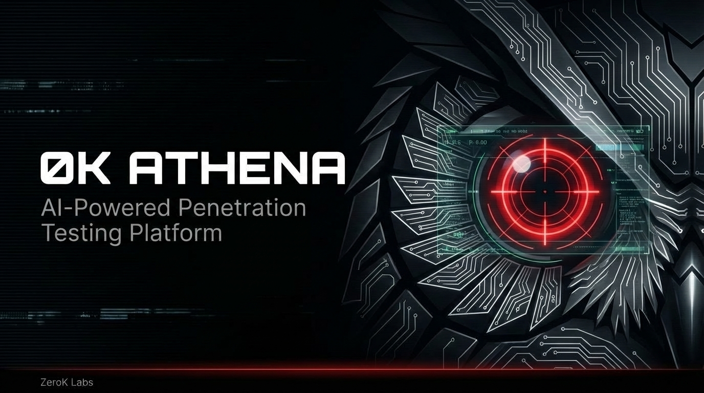

<p align="center">
  
</p>

<p align="center">
  <strong>AI-Powered Penetration Testing Platform</strong>
</p>

<p align="center">
  <a href="#license"></a>
  
  
  
  
  
</p>

---

# ØK ATHENA

**Automated Tactical Hacking and Exploitation Network Architecture**

ATHENA is a multi-agent AI penetration testing platform that coordinates 9 specialized agents to conduct authorized security assessments. Built on the Claude Agent SDK, it combines autonomous AI capabilities with human-in-the-loop (HITL) safety gates — adapting its autonomy level to the engagement context.

> **AI + Human oversight > AI alone** — Inspired by [Anthropic's AI Cyber Defenders](https://www.anthropic.com/research/building-ai-cyber-defenders)

---

## Key Features

- **10-Agent AI Team** — Strategy, Passive Recon, Active Recon, Vuln Scanner, Exploitation, Verification, Post-Exploitation, Reporting, Deep Analysis, and Probe Executor coordinate through a shared knowledge graph
- **Multi-Host Architecture** — Per-engagement host selector scopes all KPIs, charts, and findings to individual targets. Dashboard supports single-host filtering and aggregate views
- **0-Day Hunting (Phase 4.5)** — DA (Opus) generates vulnerability hypotheses, PX (Sonnet) executes targeted probes. Confirmed findings auto-generate Vulnerability Disclosure Reports (VDRs) with full reproduction steps
- **Tiered Autonomy** — CTF/Lab mode (full autonomy) vs Client mode (HITL gates) vs Client Auto (client-approved automation)
- **Cross-Engagement Intelligence (CEI)** — Learns from past engagements. Agents skip known dead-ends and prioritize proven techniques
- **Real-Time Dashboard** — 153-endpoint API, WebSocket live feed, Chart.js visualizations, HITL approval modals, scope management, attack graph, and evidence gallery
- **Budget Tracking** — Per-agent AI API cost tracking with budget limits and session-level reporting
- **Attack Chain Detection** — Automated kill chain mapping with lateral movement and privilege escalation tracking
- **Dual Kali Backends** — External (cloud) + Internal (on-premise via ZeroTier) with 50+ offensive tools
- **PTES Methodology** — Full 8-phase penetration testing execution standard with phase gating
- **RAG Knowledge Base** — Engagement-scoped knowledge base with hybrid retrieval (vector + BM25) for agent context enrichment
- **One-Command Startup** — `./start.sh` handles Neo4j, Graphiti, Langfuse, Kali health checks, and RAG sidecar

---

## Tiered Autonomy Model

ATHENA adapts its safety behavior to the engagement context:

| Mode | Novel Tools | Exploitation | HITL Gates | Use Case |
|------|-----------|-------------|-----------|----------|
| **CTF / Lab** | Full autonomy — notify ST | Full autonomy — notify ST | None | Practice, CTFs, training labs |
| **Client** (default) | ST evaluates → HITL approval | ST evaluates → HITL approval | Exploitation, scope expansion, novel tools | Healthcare, production, compliance |
| **Client Auto** | Full autonomy | Full autonomy | None | Client opts into full automation |

**Why this matters:** Most AI pentest tools are either fully manual (HITL on every action) or fully autonomous (no guardrails). ATHENA's tiered model lets you run wide-open in a lab, then flip to compliance-ready for a hospital — same platform, same agents, different risk profile.

### Novel Technique Protocol

Worker agents (AR, WV, EX, VF) aren't limited to predefined MCP tools. They can use any of Kali's hundreds of open-source tools via `execute_command`:

- **CTF/Lab**: Use freely. Just notify ST for strategy coordination.
- **Client**: Message ST with rationale → ST evaluates risk → HITL approval popup → proceed or denied.

---

## Multi-Agent Architecture

```
                 ┌───────────────────────────┐
                 │       OPERATOR (You)      │
                 │  Commands · HITL · Review │
                 └─────────────┬─────────────┘
                               │ WebSocket
                 ┌─────────────▼─────────────┐
                 │     ATHENA Dashboard      │
                 │  KPIs · Timeline · Graphs │
                 │    153 API endpoints      │
                 └─────────────┬─────────────┘
                               │ REST + WS
                 ┌─────────────▼─────────────┐
                 │   Agent Session Manager   │
                 │  Spawn · Route · Budget   │
                 │  HITL Gates · Pause/Resume│
                 └─────────────┬─────────────┘
                               │
    ┌───┬───┬───┬───┬──────────┼──────────┬───┬───┬───┐
    ▼   ▼   ▼   ▼   ▼          ▼          ▼   ▼   ▼   ▼
    ST  PR  AR  WV  EX         VF         PE  RP  DA  PX
   ───────────────────────────────────────────────────────
    │   │   │   │   │          │          │   │   │   │
    └───┴───┴───┴───┴────-─────┴──────────┴───┴───┴───┘
                               │
                    ┌─────────-▼─────────────┐
                    │      Message Bus       │
                    │   Bilateral messaging  │
                    └-─────────┬─────────────┘
                               │
                     ┌─────────▼─────────────┐
                     │ Neo4j Knowledge Graph │
                     │ Hosts · Services      │
                     │ Findings · Credentials│
                     │ Attack Chains · CEI   │
                     └─────────┬─────────────┘
                               │
                     ┌─────────┴─────────┐
                     ▼                   ▼
              ┌─────────────┐    ┌──────────────┐
              │Kali External│    │Kali Internal │
              │  50+ tools  │    │AD + Discovery│
              │   (Cloud)   │    │(ZeroTier/VPN)│
              └─────────────┘    └──────────────┘
```

| Agent | Role | Model | Phase |
|-------|------|-------|-------|
| **ST** (Strategy) | Red Team Lead — coordinates attack plan, requests workers, evaluates novel tool requests | Opus | All |
| **PR** (Passive Recon) | OSINT, subdomain enumeration, attack surface mapping — no direct target contact | Sonnet | 1 |
| **AR** (Active Recon) | Port scanning, service enumeration, host discovery | Sonnet | 2 |
| **WV** (Web Vuln Scanner) | Vulnerability scanning, directory brute-forcing, template-based detection | Sonnet | 4 |
| **EX** (Exploitation) | Exploit confirmed vulnerabilities, prove impact | Opus | 5 |
| **VF** (Verification) | Independent verification using different tools — no false positives get through | Sonnet | 4 |
| **RP** (Reporting) | Generate technical, executive, and remediation reports | Opus | 7 |
| **PE** (Post-Exploitation) | Lateral movement, privilege escalation, credential harvesting after confirmed exploit | Sonnet | 6 |
| **DA** (Deep Analysis) | 0-day hunting — hypothesis generation, response analysis, payload crafting | Opus | 4.5 |
| **PX** (Probe Executor) | Execute probes directed by DA — rapid HTTP, binary search, fuzzing, Kali tools | Sonnet | 4.5 |

### How Agents Communicate

- **Neo4j Knowledge Graph** — Shared state: hosts, services, findings, credentials, attack chains
- **Bilateral Messaging** — Direct agent-to-agent messages via dashboard API (`/api/messages`)
- **ST Coordination** — Workers report to ST; ST decides next moves and requests new agents
- **HITL Approvals** — Modal-based approve/reject for exploitation and scope expansion

---

## Cross-Engagement Intelligence (CEI)

ATHENA remembers. Past engagement data persists in Neo4j and is injected into agent context:

- **TechniqueRecords** — Which tools/techniques worked against which services
- **FalsePositiveRecords** — Known false positives to skip
- **Experience Briefs** — Data-driven summaries from past engagements injected into agent prompts

Agents prioritize techniques with high success rates and skip known dead-ends.

---

## Quick Start

### Prerequisites

- Python 3.13+ (3.14 recommended)
- Neo4j 5.x database (bolt connection)
- Kali Linux backend(s) running the MCP server
- Anthropic API key (for Claude agents)
- 1Password CLI (optional — for secure credential management)

### 1. Start ATHENA

```bash
cd tools/athena-dashboard
./start.sh
```

This handles everything:
- Detects and validates Neo4j connection
- Checks Kali backend availability (external + internal)
- Auto-starts Langfuse Docker stack (if configured)
- Initializes Graphiti cross-session memory
- Starts RAG knowledge base sidecar (mcp-proxy)
- Launches the dashboard on **http://localhost:8080**

### 2. Create an Engagement

In the dashboard sidebar, click **New Engagement** and provide:
- **Name** — Engagement identifier
- **Target** — IP, CIDR, or URL
- **Type** — `web_app`, `external`, `internal`, or `all`

### 3. Engage AI

Click **Engage AI** to start the multi-agent team. ST (Strategy Agent) activates first, analyzes the target, and spawns worker agents as needed.

### 4. Monitor & Approve

- Watch the **live event feed** for agent activity
- **HITL approval popups** appear for exploitation and scope expansion (client mode)
- Use the **command box** to direct agents: "Focus on the admin panel" or "Skip port 8080"
- **Pause/Resume/Stop** controls for engagement management

---

## Dashboard

The ATHENA dashboard is a single-page web application optimized for desktop and tablet:

- **KPI Cards** — Active engagements, hosts discovered, services, total findings, total exploitable, TTFS, MTTE
- **Host Selector** — Per-engagement host filtering in sidebar (scopes all KPIs and charts to a single target)
- **Agent Status Grid** — Real-time LED indicators for each agent (idle/running/completed)
- **Findings by Severity** — Bar chart with critical/high/medium/low/info breakdown
- **Exploit Gauge** — Confirmed exploit rate with confirmed + unverified tracking
- **Kill Chain Depth** — Visual MITRE kill chain progression
- **Attack Chains** — Detected attack paths with linked findings
- **Remediation Priority** — Bubble chart (CVSS x Hosts) grouped by CVE
- **Credential Tracker** — Harvested credentials, default/weak, unique accounts
- **Evidence Gallery** — Screenshots and artifacts with type/backend/mode filtering
- **PTES Methodology Matrix** — Phase-by-phase coverage with agent mapping and OWASP Top 10
- **Attack Graph** — Interactive Neo4j-powered node graph (hosts, services, findings)
- **Budget Tracking** — Per-agent AI API cost tracking with session-level reporting
- **AI Timeline** — Scrolling feed of agent actions, tool calls, and strategy decisions
- **Reports** — Auto-generated technical, executive, and remediation reports
- **Settings** — Configure Neo4j, Graphiti, Langfuse, Kali backends, and RAG knowledge base
- **Intelligence** — Cross-engagement intelligence data with technique success rates

---

## Kali Linux Integration

### Dual Backend Architecture

| Backend | Purpose | Tools |
|---------|---------|-------|
| **External** | Cloud-based pentesting (any provider) | 50+ tools |
| **Internal** | On-premise pentesting (ZeroTier/VPN) | ProjectDiscovery + AD tools |

### Available Tools (50+)

**Reconnaissance:** nmap, naabu, httpx, whatweb, eyewitness, enum4linux, snmpwalk, smbclient
**Web Scanning:** nikto, nuclei, gobuster, dirb, katana, kiterunner, gau, wpscan, feroxbuster
**Exploitation:** sqlmap, metasploit, hydra, john, crackmapexec, sshpass, responder
**Post-Exploitation:** mimikatz, linpeas, winpeas, chisel, ligolo
**Utility:** execute_command (any Kali tool), server_health, s3scanner, curl
**Discovery:** subfinder, amass, dnsx, uncover, tlsx

---

## Configuration

### MCP Servers (`.mcp.json`)

```json
{
  "mcpServers": {
    "kali_external": { "command": "python", "args": ["mcp_server.py", "--server", "http://your-kali-host:5000/"] },
    "kali_internal": { "command": "python", "args": ["mcp_server.py", "--server", "http://your-internal-kali:5000/"] },
    "athena-neo4j": { "command": "python", "args": ["server.py"] },
    "athena-knowledge-base": { "command": "python", "args": ["vex_kb_server.py"] },
    "playwright": { "command": "npx", "args": ["@playwright/mcp@latest", "--headless"] }
  }
}
```

### Environment Variables

Neo4j and Kali backend configuration is managed through the dashboard Settings page or environment variables:

```bash
NEO4J_URI=bolt://localhost:7687
NEO4J_USER=neo4j
NEO4J_PASS=your-password
```

---

## Observability

### Langfuse Integration (Optional)

ATHENA supports Langfuse for LLM tracing, cost tracking, and prompt analytics:

```bash
# Auto-started by start.sh if configured
docker compose -f docker/docker-compose.langfuse.yml up -d
```

### Graphiti Memory (Optional)

Temporal knowledge graph for cross-session memory. Agents can query past findings and learn from experience.

---

## Testing Methodology

### PTES Phases

1. **Pre-engagement** — Authorization, scope, rules of engagement
2. **Reconnaissance** — Active scanning, service enumeration (AR agent)
3. **Threat Modeling** — Attack surface analysis (ST agent)
4. **Vulnerability Analysis** — Scanning and detection (WV agent)
5. **Deep Analysis** — 0-day hunting with hypothesis-driven probing (DA + PX agents)
6. **Exploitation** — Prove impact with HITL approval (EX agent)
7. **Post-Exploitation** — Verify and validate findings (VF agent)
8. **Reporting** — Professional deliverables (RP agent)

### Compliance-Aware Testing (Planned)

Future support for compliance-specific test profiles:
- **PCI DSS v4.0** — Payment card industry
- **HIPAA** — Healthcare environments
- **SOC 2** — Trust services criteria

---

## Non-Destructive Testing Policy

### Approved Methods
- Read-only database queries (`SELECT`)
- Safe command execution (`whoami`, `id`, `hostname`)
- Benign XSS payloads (alert boxes)
- Authentication bypass with immediate logout
- File upload testing with harmless files

### Prohibited Actions
- Data exfiltration or downloading sensitive information
- Creating, modifying, or deleting production data
- Installing backdoors or persistent access
- Denial of service attacks
- Lateral movement beyond proof-of-concept

---

## Project Structure

```
ATHENA/
├── tools/athena-dashboard/     # Dashboard + Agent Session Manager
│   ├── start.sh                # One-command startup (Neo4j, Graphiti, Langfuse, Kali, RAG)
│   ├── server.py               # FastAPI backend (~14K lines, 153 endpoints)
│   ├── index.html              # Single-page dashboard (~17K lines)
│   ├── agent_session_manager.py # Multi-agent orchestration (~112K)
│   ├── agent_configs.py        # Agent roles, prompts, tool access (~115K)
│   ├── finding_pipeline.py     # Finding dedup, fingerprinting, persistence
│   ├── finding_utils.py        # Dedup keys, CVE extraction
│   ├── message_bus.py          # Agent-to-agent pub/sub messaging
│   ├── kali_client.py          # Kali backend HTTP client
│   ├── graphiti_integration.py # Cross-session memory
│   └── langfuse_integration.py # LLM observability
├── mcp-servers/                # Custom MCP servers
│   └── neo4j-mcp/              # Neo4j knowledge graph MCP
├── docs/                       # Documentation and learnings
│   ├── assets/                 # Images, banner art
│   └── learnings/              # Session learnings and backlog
├── intel/                      # Target intelligence
├── .claude/                    # Claude Code configuration
│   ├── agents/                 # 19 agent definitions
│   ├── commands/               # Slash commands
│   └── settings.json           # Permission configuration
├── CLAUDE.md                   # Agent system prompt + methodology
├── .mcp.json                   # MCP server configuration
└── README.md                   # This file
```

---

## License

**AGPL v3 + Commercial Dual License**

Open source under AGPL v3 for individual and non-commercial use. Commercial licensing available for enterprise deployments.

---

## Disclaimer

This framework is designed for **authorized penetration testing only**. Unauthorized access to computer systems is illegal. Always obtain explicit written authorization before conducting any security testing. Users of this framework are solely responsible for ensuring all testing activities are legal and authorized.

---

**Platform**: ØK ATHENA — AI-Powered Penetration Testing
**Status**: Alpha
**Version**: 3.0
**Last Updated**: 2026-03-31
**Maintained By**: [ZeroK Labs](https://zeroklabs.ai)

---

*Professional penetration testing requires authorization, ethical boundaries, non-destructive validation, and comprehensive evidence collection.*
